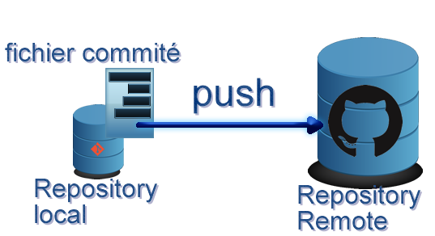
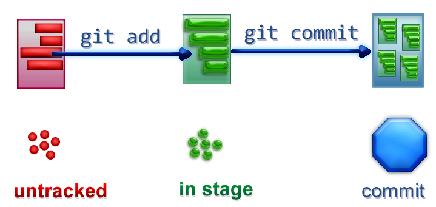
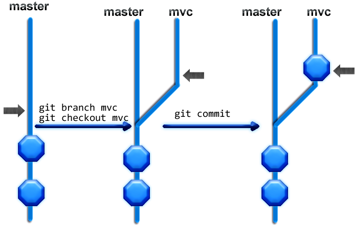
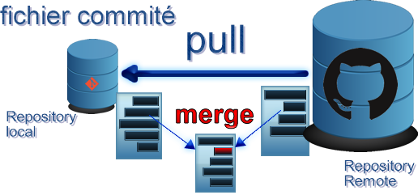
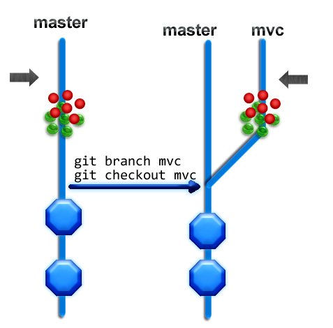

Démarrer avec Git
====

Ce guide est adapté aux débutants sur Git. Le document a été écrit en un trait, il y a encore beaucoup de choses à améliorer. Volontairement, l'esprit passe avant la lettre. Le [guide officiel](http://git-scm.com/documentation) fait foi. Il existe également une version web standard de ce [tutoriel Git sur le site de Robusta Code](http://www.robusta.io/content/tutoriel/git/start-git.html)

Si vous êtes déjà familier avec Git, vous serez plus intéressé par la section [When things go wrong](#when-things-go-wrong-).

Enjoy !

Nicolas Zozol, [Robusta Code](http://www.robusta.io)

(Ce document est en Domaine Publique)

Lexique
---

* *Commit* : un commit est un ensemble de modifications apportées et validées. Avec Git on commit d'abord sur son ordinateur, et non sur un serveur.
* *Historique* : Permet de retrouver toutes les modifications apportées au projet. Il est construit à partir de la liste des commits
* *Repository* : C'est le lieu contenant les fichiers du projet, avec **tout** son historique. Chaque developpeur du projet a son Repository *local*. Il y a aussi un Repository nommé *origin* faisant office de serveur.
* *Remote* : c'est un Repository distant, par opposition à son Repository local
* *Rollback* : revenir à une version précédente d'un fichier ou d'un projet
* *Branche* : Une branche permet d'apporter des évolutions en parallèle. Jo travaille sur la branche A, Jack travaille sur la branche B. Jack ne voit pas le travail de Jo, et vice-versa.
* *Merger* : Mélanger deux évolutions faites en parrallèle. Jo a travaillé, Jack a travaillé. Jack récupère le travail de Jo pour le merger dans son travail. Si ils ont travaillé sur les mêmes fichiers, il y a alors un risque de conflit.
* *Push* : (pousser) Envoyer ses commits vers un Repository Remote
* *Pull* : (tirer) Récupérer les commits des autres membres de l'équipe depuis le Repository
* *SSH* : Protocole sécurisé permettant de transmettre des commandes ou des fichiers

Je considère que vous êtes sous Windows.

Telechargez [Git For Windows](http://msysgit.github.io/)

Installez Git. Vérifiez qu'il exist un fichier .gitconfig dans Users/moi

		[user]
			name = nicorama
			email = nz@robusta.io
		[core]
			excludesfile = ~/.gitignore_global

.gitignore_global
---

Ce fichier permet d'éviter d'envoyer certains fichiers sur le Repository.
Essentiellement les fichiers du build et les libs. En fait on ne doit push que le code, et les images.

Voici le fichier [.gitignore_global](.gitignore_global) que j'utilise. La bonne pratique voudrait que l'on ignore les fichier de metadata de l'IDE tel que Eclipse.

Bien débuter
----

Pour demarrer avec git, il vaux mieux s'attaquer avec les lignes de commandes. C'est la *vérité vraie*. Une fois que l'on a compris les fondamentaux et absorbé le vocabulaire, on peut utiliser les outils graphiques pour les opérations de routine et retourner en ligne de commande pour les cas plus complexes.

* On lance donc Git Bash plutot que Git gui
* On fait alors tourner une sorte de Cygwin, et les commandes linux courantes fonctionnent
* `cd /c/wode/workspace` vous mène dans votre workspace

Il est possible de communiquer avec un repo Git distant en SSH ou avec HTTP. Il est plus simple d'utiliser HTTP. On distingue les adresses Http avec https://user/monrepo.git  d'une commande ssh du style user@monrepo.git
Parait-il, ssh bien utilisé est plus sûr.

Principes de Git
----

Trois grands principes :

* Chaque repo est égal l'un envers l'autre
* Git stocke des documents complets et non des différences entre deux versions

Si bien qu'il est possible de merger monRepo/brancheMaster/service/MonService.java avec linusRepo/brancheFeature/workInProgress/MonService.java même si les deux projets n'ont rien à voir

* Le répertoire caché .git contient tout l'historique du projet

Les avantages de Git
---

* Il est très facile de merger. C'est rarement un GROS problème.
* Il est du coup très facile de faire des branches, ce qui evite de mélanger des problèmes features entre eux.
* Il est très difficile de faire un rollback, mais c'est TOUJOURS possible.

Je m'explique sur le dernier point : il y a plusieurs commandes - checkout, revert, reset, stash, reflog... - permettant de résoudre un problème. Il faut donc utiliser la bonne, avec les options qui vont bien. C'est donc difficile, mais c'est bel et bien un gros point positif de Git.

Les commandes de demarrage
---

Si le projet a été créé en local :

		git init

Cela crée un répertoire .git et demarre le versioning

Si le projet est déjà sur le web :

		git clone https://user/monRepo.git

Cela récupère les fichiers du Repository distant sur notre disque dur local. Le répertoire `.git/` est également copié ; il contient tout l'historique et nous avons donc créé un **Repository local**. Comme les deux projets local et distant ont TOUT l'historique, il ne faut surtout pas versionner les builds et libs.

		git status

C'est la commande la plus fréquente. Elle permet de savoir où l'on en est, et donne des tips pour rollback.
Si on fait `git status` au début du projet, on devrait être sur la branche *master*, c'est à dire la branche principale.

Le cycle d'un commit
===

etat initial : le fichier n'est pas tracké dans .git/

* `git add myFile` : le fichier est tracké. Un snaphot est mémorisé dans .git/
* `git add otherFile` : le fichier est tracké. Un snaphot est mémorisé dans .git/
* `git add myFile` : le fichier est modifié et était déjà tracké. Un nouveau snapshot écrase l'ancien.

Ces snapshots sont jusqu'à présent placés dans un endroit appelé "stage"

* `git add .` : tous les fichiers et répertoires modifiés ou non trackés sont rajoutés au stage
* `git commit -m "myMessage"` : un snapshot des deux fichiers est créé. Le "stage" est effacé.

Voila, vous avez fait votre premier commit !

La différence notable avec CVS ou Subversion est la présence de ce *stage*. On peut se demander quelle est l'utilité de cet état intermédiaire. Il vous aidera pourtant à rattraper bien des erreurs.

* En fait, après un commit, il existe toujours des traces du stage. Les Git Ninja utiliseront la commande *reflog* pour récupérer ces traces.
* Après chaque commande, `git status` nous donne l'état des lieux
* On peut ainsi faire plusieurs commits. `git log -3` nous rappelle les 3 derniers commits
* N'oubliez pas l'option -m "message du commit". Sinon vous serez expédiés dans vim, et en général, vous ne voulez pas cela.

Récupérer des Commits, Envoyer ses Commits
----

Une Remote est un repository distant. On **pull** les modifications des collègues depuis une Remote. On **push** ses commits vers une Remote pour partager son travail.

Quand on fait `git clone https://anyRemote`, on rajoute anyRemote à la liste de ses remotes.

		git remote -v : liste les remotes enregistrées

		git add remote origin https://github.com/robusta-code/forum.git 

Cette commande rajoute une remote nommée "origin" pointant vers le repo forum.git. 

Bien que cela n'est pas fondamentalement obligatoire, la remote de Github ou Bitbucket fait en général office de *serveur central*, c'est-à-dire que les developpeurs vont *pusher* vers cette remote, ou *puller* depuis elle.

Il est un milliard de fois conseillé d'appeler cette branche *origin*, et pas *toto*, tout comme il est conseillé de garder le nom *master* pour la branche principale.

Dans beaucoup de cas, un projet se contentera d'une seule remote. Si on se lance dans l'open source, cela evoluera.

		git push origin master : envoie la branche courante vers la branche master de origin.

 Avec la commande précédente, nous envoyons donc la branche *master locale* vers la branche *origin/master*.

 		git pull origin master : récupère et merge la branche master vers la branche courante

Création et Utilisation des branches
====

Création de la branche
----

* `git branch mvc` : crée une branche dédié à la feature MVC. Le code y est exactement le même que *master*
* `git checkout mvc` : on se déplace dans la branche *mvc*
* `git checkout -b mvc` : raccourci permettant de créer la branche mvc et de s'y déplacer
* `git status` : nous signifie que l'on est bien dans la branche *mvc*

Création de la feature
---
La voie royale est de créer une branche par feature, aussi petite soit-elle.
En créant cette feature, je modifie mes fichiers, *master* et *mvc* sont donc dans des états différents. Le processus normal est alors le suivant :

* je fais ma feature dans *mvc*
* `git add .`
* git commit -m "super mvc"
* Oups, quelques debug
* `git add .`
* `git commit -m "fixed issue with my super mvc"`

Merge
----

Pour rappatrier mes modifications dans *master*, il faut faire un merge : on se met dans *master* et on merge.

		`git checkout master`
		`git merge mvc`

Push
---

En général, pas de soucis. Reste à signaler aux collègues nos modifications en les envoyant vers *origin*.

		//je suis bien dans la branche master
		git push origin master
		// je rentre mon login/mot de passe

* Attention, on peut être dans la branche *mvc* et l'envoyer vers origin/master
* Notre branche locale *mvc* ne sert plus, on peut éventuellement l'effacer en faisant `git branch -d mvc`

Pull
---

Un autre scenario est de travailler à deux sur la branche *mvc*

* je fais ma feature dans *mvc*
* `git add .`
* git commit -m "super mvc without bug"
* git push origin mvc
* Still work to do in this mvc
* `git commit -m "Cool stuff !"`
* git push origin mvc

Et là c'est le drame. Impossible de push car **Jo** a également modifié origin/mvc. Il faut donc récupérer son travail. Git fera très souvent le merge tout seul, mais il faudra éventuellement résoudre quelques conflits.

* `git pull origin mvc`
* `git log -4` : *pull* crée tout seul un *commit de merge*
* On vérifie que tout fonctionne, ou on résoud le merge avec des outils comme IntelliJ, Eclipse, vim...

Il ne nous reste plus qu'à envoyer notre travail sur origin

* `git push origin mvc` : hourrah !

Git Flow
---

Après quelques temps, vous trouverez naturel d'adopter un système tel que [celui-ci](http://nvie.com/posts/a-successful-git-branching-model/).
[Git Flow](https://github.com/nvie/gitflow) permet d'arriver à ce modèle assez facilement.

When things go wrong !
====

Voici un pot-pourri des recettes lorsque les choses déraillent. Une première chose à comprendre est que :

* On est sur *master*
* On commit
* On fait des changements, dont quelques add
* On passe à une nouvelle branche *mvc*

Tout ce qui n'a pas été committé se retrouve alors sur la branche *mvc*, y compris le stage.
Si dans *mvc*, je fais `git add . ; git commit` alors ces modifications sont enregistrées dans *mvc*, et non *master*.

Rajouter des changements au commit précédent
---

Encore une fois, vous êtes allés trop vite, il y a une petite retouche css à faire.

        git add styles.css
        git commit -m "changed styles"

        # oups, modification des styles
        git add styles.css
        git commit --amend # le message sera le même que le précédent

Encore une fois vous avez tapé votre commit trop vite, et il y a une typo dans le message

		git commit -m "colo styles"
		#oups, typo
		git commit --amend -m "coloration for styles"

Changements qui partent à vau-l'eau
----

### discard staged changes

		git reset --soft HEAD

* Les modifications sont maintenant *unstaged*
* On peut alors les supprimer

### discard unstaged changes

		git checkout -- .

Checkout peut en effet s'effectuer sur une branche ou un fichier. Appliqué à un fichier, on va donc "checkout" ce qu'il y avait au dernier commit.

Le double-dash indique que l'on s'occupe bien des fichiers, et non des branches. 

## Argh, that's shit

Mon commit est pourri, jetons-le

		vim CoolStuff.java
		# editing  CoolStuff.java
		git add CoolStuff.java
		git commit -m "cool stuff"
		#ooohh that sucks
		git reset --hard HEAD

Dans ce cas CoolStuff.java n'existe plus. Tout se retrouve strictement dans l'état du commit précédent. **A utiliser avec les plus grandes précautions !**

On peut également utiliser cette technique pour se remettre d'un merge qui s'est très mal passé.

Reculer d'un commit et annuler le précédent
---

* `git revert HEAD` : créera un nouveau commit qui annulera les changements de HEAD
* `git reset --hard HEAD~1` : detruira le dernier commit

Déplacer les commits dans une nouvelle branche
----

Exemple courant : on veut faire une tâche sur master, mais ca se complique après *2* commits. On veut la déplacer dans une nouvelle branche.

	    git branch mvc
	    git reset --hard HEAD~2

En créant *mvc*, cette branche récupère tout l'historique, y compris les deux commits miteux. On est toujours sur *master*, et donc en faisant *rest --hard* on supprime les deux commits de *master*. Rassurez-vous :  ils sont toujours sur *mvc*.

[Explications sur Stack](http://stackoverflow.com/a/6796816/968988)

commit dans la mauvaise branch
---

ex : j'ai commité dans *master*, au lieu de *mvc*

On va partir en arrière 

		git checkout master
		git reset --soft HEAD~1
		git checkout mvc
		
Avec *reset --soft*, on ne détruit pas le commit, mais ce qui a été commité est maintenant en *staged*. En bougeant de branche, cette nouvelle branche récupère les modifications en cours.

Et après
====

Il faut bien tout cela pour *débuter* en Git. Après cela devient tout de suite plus compliqué. refs, prune, cherry-pick, bisect, patch, tag. Des commandes, des options, en veux-tu ?  [En voilà](http://git-scm.com/docs).
